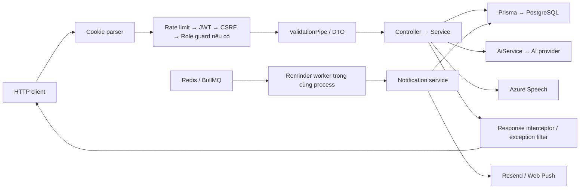
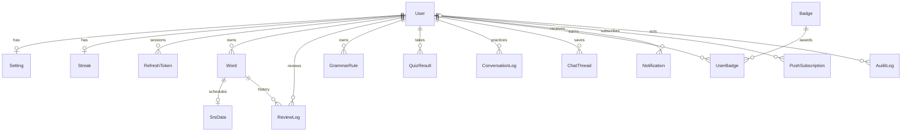
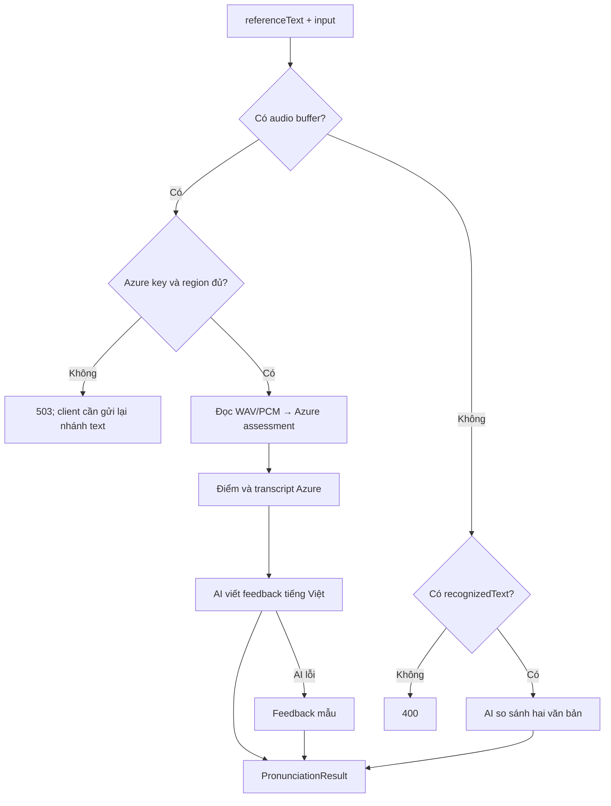
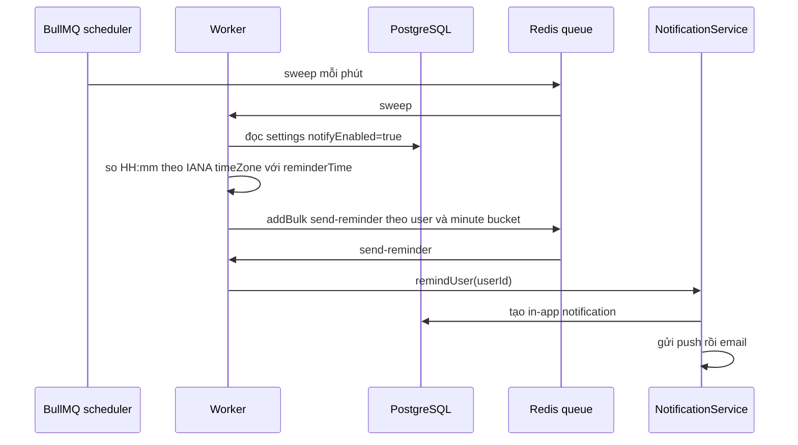

# LEXI BACKEND — ĐẶC TẢ HIỆN TRẠNG VÀ KẾ HOẠCH REBUILD SPRING BOOT

> Cập nhật sau khi đối chiếu mã nguồn ngày **22/09/2026**.
>
> Phạm vi: **backend NestJS trong `backend/`**. Tài liệu mô tả HTTP contract, dữ liệu, nghiệp vụ, tích hợp, vận hành, kiểm thử và hướng chuyển sang Spring Boot. Không đặc tả giao diện.
>
> Phần 1–13 mô tả mã nguồn hiện tại; phần 14 ghi nhận thiếu sót; phần 15–17 là đề xuất và tiêu chí nghiệm thu. Một tính năng có trong roadmap, enum, comment hoặc prompt AI **không đồng nghĩa đã triển khai hoàn chỉnh**.

## Mục lục

1. [Phạm vi và kết luận rà soát](#1-phạm-vi-và-kết-luận-rà-soát)
2. [Kiến trúc và công nghệ](#2-kiến-trúc-và-công-nghệ)
3. [Quy ước HTTP, xác thực và phân quyền](#3-quy-ước-http-xác-thực-và-phân-quyền)
4. [Danh mục đầy đủ 77 API](#4-danh-mục-đầy-đủ-77-api)
5. [DTO và cấu trúc dữ liệu trả về](#5-dto-và-cấu-trúc-dữ-liệu-trả-về)
6. [Database: 18 model và 11 enum](#6-database-18-model-và-11-enum)
7. [Nghiệp vụ từ vựng, ngữ pháp và smart input](#7-nghiệp-vụ-từ-vựng-ngữ-pháp-và-smart-input)
8. [Ôn tập, SM-2 và quiz](#8-ôn-tập-sm-2-và-quiz)
9. [AI, hội thoại và luyện kỹ năng](#9-ai-hội-thoại-và-luyện-kỹ-năng)
10. [Thống kê, streak và huy hiệu](#10-thống-kê-streak-và-huy-hiệu)
11. [Thông báo, Redis và background jobs](#11-thông-báo-redis-và-background-jobs)
12. [Quản trị và audit](#12-quản-trị-và-audit)
13. [Cấu hình, triển khai và kiểm thử](#13-cấu-hình-triển-khai-và-kiểm-thử)
14. [Các thiếu sót cần xử lý](#14-các-thiếu-sót-cần-xử-lý)
15. [Thiết kế chuyển sang Spring Boot](#15-thiết-kế-chuyển-sang-spring-boot)
16. [Lộ trình và tiêu chí nghiệm thu](#16-lộ-trình-và-tiêu-chí-nghiệm-thu)
17. [Ma trận kiểm thử backend cần bổ sung](#17-ma-trận-kiểm-thử-backend-cần-bổ-sung)

## 1. Phạm vi và kết luận rà soát

### 1.1. Nguồn đối chiếu

Nguồn chính là controller, DTO, service và các file:

- [Bootstrap](../backend/src/main.ts), [AppModule](../backend/src/app.module.ts).
- [Schema Prisma](../backend/prisma/schema.prisma), [SQL migrations](../backend/prisma/migrations), [cấu hình Prisma](../backend/prisma.config.ts).
- [Dependencies và scripts](../backend/package.json), [lockfile](../backend/package-lock.json).
- [Mẫu biến môi trường](../backend/.env.example), [validation cấu hình](../backend/src/config/env.validation.ts).
- [Dockerfile](../backend/Dockerfile), [Render Blueprint](../backend/render.yaml).
- Unit tests trong `backend/src/**/*.spec.ts` và [test E2E](../backend/test/app.e2e-spec.ts).

Không dùng `dist/` làm nguồn đặc tả. Không truy cập database triển khai, gọi dịch vụ AI thật hoặc gửi email/push trong đợt rà soát này. Các kết luận về deployment là kết luận từ cấu hình trong repository, không xác nhận hệ thống production đang chạy như thế nào.

### 1.2. Những điểm đã sửa so với bản tài liệu cũ

| Nội dung | Hiện trạng xác minh |
|---|---|
| Số enum | **11**, có cả `ChatKind`; số model là **18** |
| Số API nghiệp vụ/health | **77 route** trong controller; không tính Swagger |
| Access/refresh token | Access là JWT; refresh là chuỗi ngẫu nhiên opaque, không phải JWT |
| Response đăng nhập | `{ user, csrfToken }` trong envelope; token xác thực được đặt vào cookie |
| API lấy CSRF | Không có `GET /auth/csrf-token`; token được cấp khi register/login/refresh |
| Thống kê admin | `GET /admin/overview`; không có `GET /admin/stats` |
| Đổi role qua API | Chưa có; script seed admin có thể tạo/nâng role |
| Streaming | Có helper stream trong AiService, chưa có controller SSE |
| SM-2 | Biến thể 1 → 3 ngày, hệ số 0.7, trần interval 21, ease 1.3–2.5 |
| Streak | Đếm từ khác nhau đã ôn, theo UTC; cập nhật khi gọi `GET /streak` |
| Audio | Đã có Azure Pronunciation Assessment; xử lý WAV trong bộ nhớ |
| Redis | Dùng cho BullMQ; chưa triển khai cache kết quả AI/dictionary |
| CSV | Nhận text trong JSON và trả CSV trong JSON; không phải upload/download file trực tiếp |
| AI JSON schema | Schema nằm trong prompt; parse JSON nhưng chưa validate schema ở runtime |
| E2E | Còn test mẫu `GET / → Hello World!`, chưa phản ánh API hiện tại |
| Tính sẵn sàng production | Còn các thiếu sót cụ thể ở phần 14; chưa đủ cơ sở kết luận đã production-ready |

### 1.3. Vai trò và giới hạn chức năng

- **Guest:** register, login, refresh, logout, tra một/nhiều từ, health.
- **Người đã đăng nhập:** dữ liệu cá nhân, review/quiz, kỹ năng AI, progress, notification. Các route này không giới hạn riêng role LEARNER; admin có JWT cũng có thể dùng.
- **ADMIN:** thêm quyền quản lý kho TOEIC, scenario, metadata tài khoản, thống kê và audit.

Chưa có luồng Google OAuth, xác minh email, quên/đổi mật khẩu, xóa tài khoản, đổi role qua REST API, lưu lịch sử bài viết/phát âm/dictation hoặc endpoint TTS backend. Các trường `provider=GOOGLE`, `emailVerified`, `ttsVoice` chỉ là nền dữ liệu/cấu hình, không chứng minh những API đó đã tồn tại.

## 2. Kiến trúc và công nghệ

### 2.1. Stack xác định từ repository

| Thành phần | Hiện trạng |
|---|---|
| Runtime/container | Node.js 22 trong Docker, Express qua NestJS |
| Framework | NestJS 11; lockfile ghi `@nestjs/core 11.1.27` |
| Ngôn ngữ | TypeScript; lockfile 5.9.3, target **ES2023**, module/moduleResolution `nodenext` |
| ORM | Prisma 7.8.0, generator `prisma-client`, output `generated/prisma`, CommonJS |
| Database | PostgreSQL qua `@prisma/adapter-pg` và `pg` |
| Auth | Passport JWT, bcrypt, cookie-parser, SHA-256 cho refresh token |
| Validation/API docs | class-validator, class-transformer, Swagger |
| AI | SDK `openai 6.45.0` dùng endpoint tương thích của DeepSeek theo cấu hình |
| Audio | Microsoft Cognitive Services Speech SDK |
| Jobs | BullMQ 5.79.2, ioredis, `@nestjs/bullmq` |
| Email/push | Resend, web-push/VAPID |
| Test | Jest 30.4.2, ts-jest 29.4.11, Supertest |

Các phiên bản trên là bản khóa trong dự án, không phải khuyến nghị “phiên bản mới nhất”.

### 2.2. Luồng xử lý



### 2.3. Module và trách nhiệm

| Thư mục `backend/src/` | Trách nhiệm |
|---|---|
| `auth/` | Register/login, tokens/cookies, JWT/CSRF/roles guards |
| `users/` | Profile, settings |
| `words/` | Tra từ, batch lookup, verify, notebook, quick-add, examples |
| `grammar/`, `smart-input/` | Notebook ngữ pháp, preview, phân loại input |
| `review/` | SM-2, due/flashcards, tạo/lưu/nộp quiz |
| `ai/` | Client AI tập trung, prompts/schema/types theo từng feature |
| `conversation/`, `chat/` | Role-play có lưu DB; lưu thread chat do client gửi |
| `skills/`, `context/` | Writing, pronunciation/Azure, dictation, tutor, grammar Q&A, context |
| `progress/` | Stats, streak, badges |
| `notification/` | In-app, push/email, scheduler/worker |
| `admin/` | Users, TOEIC, scenarios, overview, audit |
| `common/`, `config/`, `prisma/`, `health/` | Hạ tầng dùng chung, lifecycle DB, health |

Service truy cập Prisma trực tiếp; chưa có repository abstraction riêng, event bus nghiệp vụ hoặc microservice độc lập. `ScheduleModule` được import nhưng lịch nhắc học thực tế được đăng ký bằng BullMQ Job Scheduler.

## 3. Quy ước HTTP, xác thực và phân quyền

### 3.1. Đường dẫn, status và envelope

Backend không đặt global prefix `/api` hoặc version `/v1`. Đường dẫn trong tài liệu là đường dẫn backend, ví dụ `/words`. Cookie refresh được cấu hình theo đường dẫn proxy bên ngoài `/api/auth` — cần giữ sự khác biệt này khi tích hợp.

- Swagger UI: `/docs`.
- GET/PATCH/DELETE mặc định trả **200**.
- POST mặc định trả **201**, kể cả tra từ, chấm điểm, submit quiz, khóa user.
- Ngoại lệ: `POST /auth/login`, `/auth/refresh`, `/auth/logout` có `@HttpCode(200)`.
- Response JSON thành công được bọc bởi `TransformInterceptor`:

```json
{
  "success": true,
  "data": {
    "items": [],
    "total": 0,
    "page": 1,
    "limit": 20
  }
}
```

Lỗi qua `AllExceptionsFilter`:

```json
{
  "success": false,
  "statusCode": 404,
  "message": "Word not found",
  "error": "Not Found",
  "path": "/words/example-id",
  "timestamp": "2026-09-22T00:00:00.000Z"
}
```

`message` có thể là string hoặc string[] khi validation thất bại. Lỗi không phải `HttpException` được trả 500 với message chung; không có mapper Prisma error toàn cục sang 409/404. Lỗi từ service có thuộc tính `retryable` hiện **bị filter bỏ mất** trong HTTP response.

### 3.2. Session và cookies

Nguồn: [AuthService](../backend/src/auth/auth.service.ts), [cookie helper](../backend/src/auth/auth-cookies.ts), [JWT strategy](../backend/src/auth/strategies/jwt.strategy.ts).

| Cookie | HttpOnly | Path | Thời hạn |
|---|---|---|---|
| `access_token` | Có | `/` | Session cookie; JWT exp mặc định 15 phút |
| `refresh_token` | Có | **`/api/auth`** | `JWT_REFRESH_EXPIRES_DAYS`, mặc định 30 ngày |
| `csrf_token` | Không | `/` | Cùng maxAge với refresh |

Cả ba dùng `SameSite=Lax`, `Secure=true` khi `NODE_ENV=production`, không set Domain. Khi gọi backend trực tiếp tại `/auth/refresh`, cookie jar tuân thủ Path sẽ không tự gửi cookie scoped `/api/auth`; smoke test phải đi qua proxy tương ứng hoặc chủ động dựng Cookie header.

Luồng:

1. Register kiểm tra email trùng, hash mật khẩu bcrypt cost 10, tạo User + Setting + Streak; sau đó cấp tokens.
2. Login tra email chính xác như gửi lên, kiểm tra khóa tạm và khóa admin, so sánh bcrypt.
3. Sai mật khẩu ở tài khoản tồn tại: tăng số lần sai; lần thứ 5 đặt khóa 15 phút và reset bộ đếm về 0. Request sai thứ 5 vẫn trả 401; request trong thời gian khóa trả 403.
4. Login đúng reset lockout và cập nhật `lastActiveAt`.
5. Access JWT chứa `sub`, `email` cùng claim thời gian do thư viện cấp. Role không nằm trong payload nghiệp vụ.
6. Refresh raw là `randomBytes(32).toString('hex')`; DB chỉ lưu hash SHA-256. CSRF cũng được tạo từ 32 byte ngẫu nhiên.
7. Refresh kiểm tra tồn tại, hết hạn, thu hồi và trạng thái disabled của user; thu hồi token cũ, cập nhật activity, cấp mới cả access/refresh/CSRF.
8. Tái sử dụng token đã revoked: thu hồi **tất cả refresh token chưa revoked của user**, không chỉ một “family”; schema chưa có family/session id.
9. Logout thu hồi token refresh được gửi và xóa cả ba cookie đúng path. Chưa có blacklist access JWT; một bản sao access token vẫn hợp lệ đến hết exp.

Login/register trả `data: { user: SafeUser, csrfToken }`; refresh trả `data: { csrfToken }`; logout trả `data: { message: "Logged out" }`. Không trả access/refresh token trong JSON.

### 3.3. Guards, ownership và CORS

- Thứ tự global guards: Throttler → JWT → CSRF.
- `@Public()` bỏ qua JWT và CSRF, **không** bỏ rate limit.
- JWT lấy cookie trước, Bearer header sau. `validate()` kiểm tra payload/sub, chưa tra DB trạng thái tài khoản.
- CSRF: protected POST/PATCH/DELETE phải gửi `x-csrf-token` bằng cookie `csrf_token`, so sánh timing-safe. Áp dụng cả request dùng Bearer; chỉ Bearer token chưa đủ để gọi protected write.
- `RolesGuard` của admin đọc role mới nhất từ DB. Chưa kiểm tra `disabledAt` trong guard này.
- Word/grammar/quiz/conversation/chat/notification cá nhân kiểm tra `id + userId`; không thuộc quyền sở hữu thường trả 404.
- CORS nhận danh sách origin phân cách bằng dấu phẩy. Mặc định `*` thì `credentials=false`; danh sách cụ thể thì `credentials=true`. Không có xử lý wildcard preview domain riêng.

### 3.4. Rate limit và validation chung

| Nhóm | Giới hạn cấu hình |
|---|---|
| Mặc định | 60 request/phút/tracker mặc định theo IP và route |
| `POST /words/lookup` | 15/phút |
| `POST /words/lookup-batch` | 6/phút |
| Route `@AiThrottle()` | 20/phút |

Route AI gồm verify, quick-add, sinh examples, grammar preview/examples, classify, quiz generate, conversation start/reply/end, writing, pronunciation, dictation, grammar Q&A, tutor, context. Auth hiện chỉ dùng mức mặc định, thêm lockout theo tài khoản.

Chưa cấu hình Redis storage cho throttler, custom tracker theo user hoặc trust-proxy rõ ràng. Không xem giới hạn trên là quota AI toàn hệ thống hoặc hạn mức theo tài khoản.

ValidationPipe bật `whitelist`, `forbidNonWhitelisted`, `transform`, `enableImplicitConversion`: field không khai báo DTO bị từ chối. Tuy nhiên validation chưa đồng nhất: một số string không có giới hạn, boolean có ép kiểu ngầm, `commit` chưa có `@IsBoolean()`, nội dung chat lưu DB chưa validate sâu. Các điểm này nằm trong backlog.

## 4. Danh mục đầy đủ 77 API

Quy ước: **P** = public; **U** = đăng nhập; **A** = ADMIN. Body/query dùng JSON trừ pronunciation có multipart. Tất cả output dưới đây là nội dung bên trong `data`; xem phần 3 cho HTTP status/envelope và phần 5 cho DTO.

### 4.1. Auth, health, profile — 7 API

| Method + đường dẫn | Quyền | Input | Output/hành vi |
|---|---|---|---|
| `POST /auth/register` | P | email, password | SafeUser, csrfToken, Set-Cookie |
| `POST /auth/login` | P | email, password | SafeUser, csrfToken, Set-Cookie |
| `POST /auth/refresh` | P | refresh cookie | csrfToken, xoay cookies |
| `POST /auth/logout` | P | refresh cookie nếu có | message, clear cookies |
| `GET /health` | P | — | status, database, uptime, timestamp |
| `GET /users/me` | U | — | Profile + **setting** + streak |
| `PATCH /users/me/settings` | U | Các field settings tùy chọn | Setting sau upsert |

### 4.2. Vocabulary, grammar, smart input — 17 API

| Method + đường dẫn | Quyền | Input | Output/hành vi |
|---|---|---|---|
| `POST /words/lookup` | P | term, level? | DictionaryResult; không lưu |
| `POST /words/lookup-batch` | P | text, level? | items[{term,result,error}] |
| `POST /words/verify` | U | term, meaning?, level? | VocabVerifyResult; không lưu |
| `POST /words` | U | CreateWordDto | Word + srsData |
| `POST /words/quick-add` | U | text, topic? | word, isToeicTerm, synonyms có isToeic |
| `GET /words` | U | search?, topic?, status?, sort?, page?, limit? | items, total, page, limit |
| `GET /words/:id` | U | id | Word + SRS + 10 reviewLogs mới nhất |
| `DELETE /words/:id` | U | id | deleted; cascade SRS/reviews |
| `POST /words/:id/examples` | U | count? | generated, word |
| `POST /grammar/preview` | U | rule | isValid, title, formula, explanation, examples |
| `POST /grammar` | U | title?, formula, explanation, examples? | GrammarRule |
| `GET /grammar` | U | search?, page?, limit? | items, total, page, limit |
| `GET /grammar/:id` | U | id | GrammarRule |
| `PATCH /grammar/:id` | U | Các field CreateGrammarDto tùy chọn | GrammarRule |
| `DELETE /grammar/:id` | U | id | deleted |
| `POST /grammar/:id/examples` | U | count? | generated, rule |
| `POST /smart-input/classify` | U | text | type, confidence, term, meaning, rule, reason |

Không có `PATCH /words/:id`. Không có API CRUD grammar SRS; SRS hiện chỉ áp dụng Word.

### 4.3. Review và quiz — 7 API

| Method + đường dẫn | Quyền | Input | Output/hành vi |
|---|---|---|---|
| `GET /review/due` | U | limit? | items, count, total |
| `POST /review/answer` | U | wordId, rating | srsData, status, nextReviewAt |
| `GET /review/flashcards` | U | mode?, scope?, limit? | mode, scope, count, cards |
| `POST /quiz/generate` | U | count? | quizId, total, questions; ẩn đáp án |
| `GET /quiz/:id` | U | id | quizId, total, score, status, questions + tiến trình |
| `PATCH /quiz/:id/progress` | U | answers | saved |
| `POST /quiz/submit` | U | quizId, answers | quizId, score, total, results |

Chưa có endpoint list lịch sử quiz. Quiz không tự cập nhật SRS hoặc tạo ReviewLog.

### 4.4. Conversation, skills, context và chat — 17 API

| Method + đường dẫn | Quyền | Input | Output/hành vi |
|---|---|---|---|
| `POST /conversation/start` | U | scenario | id, scenario, status, opening |
| `POST /conversation/:id/reply` | U | message | reply, feedback, suggestion |
| `POST /conversation/:id/end` | U | id | summary{strengths,weaknesses,overall} |
| `GET /conversation` | U | — | Mảng metadata, chưa phân trang |
| `GET /conversation/:id` | U | id | Transcript và feedback đã parse |
| `POST /writing/grade` | U | text | correctedText, issues, overallComment, score |
| `POST /pronunciation/score` | U | referenceText; audio hoặc recognizedText | score, transcriptHeard, mispronounced, feedback |
| `POST /dictation/generate` | U | level?, count?, topics? | sentences[] |
| `POST /dictation/explain` | U | reference, attempt | feedback |
| `POST /grammar-qa/ask` | U | question, history? | answer; JSON thường |
| `POST /tutor/ask` | U | question, history? | answer, words, grammar |
| `POST /context/analyze` | U | passage, level? | highlights, note |
| `GET /chat/threads` | U | **kind bắt buộc** | Mảng metadata, chưa phân trang |
| `GET /chat/threads/:id` | U | id | id, kind, title, messages, createdAt, updatedAt |
| `POST /chat/threads` | U | kind, title, messages | id, kind, title, updatedAt |
| `PATCH /chat/threads/:id` | U | messages bắt buộc, title? | id, kind, title, updatedAt |
| `DELETE /chat/threads/:id` | U | id | **{id}**, không phải {deleted:true} |

Không có endpoint learner đọc ngân hàng scenario. `start` nhận chuỗi scenario tự do, không nhận scenarioId và không query `ConversationScenario`.

### 4.5. Progress và notification — 10 API

| Method + đường dẫn | Quyền | Input | Output/hành vi |
|---|---|---|---|
| `GET /stats/overview` | U | period? | Thống kê word/review/quiz |
| `GET /stats/weakness` | U | — | weakTopics, weakWords |
| `GET /streak` | U | — | Streak + today; có ghi DB/cấp badge |
| `GET /badges` | U | — | newlyEarned, badges; có thể ghi DB |
| `GET /notifications/vapid-public-key` | U | — | publicKey hoặc null |
| `POST /notifications/subscribe` | U | endpoint, keys{p256dh,auth} | subscribed |
| `DELETE /notifications/subscribe` | U | endpoint trong body | unsubscribed |
| `GET /notifications` | U | page?, limit? | items, total, unread, page, limit |
| `PATCH /notifications/read-all` | U | — | updated: số bản ghi |
| `PATCH /notifications/:id/read` | U | id | Notification |

### 4.6. Admin — 19 API

Tất cả yêu cầu role ADMIN; protected write vẫn cần CSRF.

| Method + đường dẫn | Input | Output/hành vi |
|---|---|---|
| `GET /admin/overview` | — | totalUsers, activeUsers, totalWords, totalScenarios, lockedUsers |
| `GET /admin/users` | search?, status?, role?, page?, limit? | Danh sách metadata user |
| `GET /admin/users/:id` | id | Metadata user |
| `POST /admin/users/:id/lock` | reason | Metadata sau khóa; revoke refresh; audit |
| `POST /admin/users/:id/unlock` | **reason bắt buộc** | Metadata sau mở khóa; audit |
| `GET /admin/words` | search?, group?, page?, limit? | TOEIC list phân trang |
| `POST /admin/words` | word, meaning, group? | ToeicWord |
| `PATCH /admin/words/:id` | word?, meaning?, group? | ToeicWord |
| `DELETE /admin/words/:id` | id | deleted |
| `POST /admin/words/import` | text, commit? | rows, added, skipped, committed |
| `GET /admin/words/export` | — | csv, count; có ghi audit |
| `GET /admin/scenarios` | search?, difficulty?, status?, page?, limit? | Scenario list phân trang |
| `POST /admin/scenarios` | name, description, roleHint, difficulty | Scenario mặc định enabled |
| `PATCH /admin/scenarios/:id` | Các field tạo tùy chọn | Scenario |
| `POST /admin/scenarios/:id/toggle` | id | Scenario với enabled đảo giá trị |
| `POST /admin/scenarios/:id/duplicate` | id | Bản sao mới, enabled=false |
| `DELETE /admin/scenarios/:id` | id | deleted |
| `GET /admin/audit` | admin?, action?, page?, limit? | Audit list phân trang |
| `GET /admin/audit/admins` | — | Mảng email admin từng có trong audit |

## 5. DTO và cấu trúc dữ liệu trả về

### 5.1. Ràng buộc request

`?` chỉ field tùy chọn. Độ dài dưới đây là rule DTO hiện có, không phải giới hạn column PostgreSQL.

| DTO/nhóm | Ràng buộc |
|---|---|
| Register | email hợp lệ; password string 8–72 ký tự. Chưa chuẩn hóa email hoặc kiểm tra 72 **byte UTF-8** |
| Login | email hợp lệ; password string, chưa có MinLength/MaxLength |
| Settings | dailyGoal integer 1–500; cefrLevel A1–C2; topics string[]; reminderTime HH:mm; timeZone IANA hợp lệ; notifyEnabled boolean; ttsVoice EN_US/EN_GB |
| Lookup | term không rỗng, tối đa 100; level? A1–C2 |
| Batch lookup | text không rỗng, tối đa 500; level?; parser giới hạn tối đa 8 kết quả |
| Verify word | term không rỗng ≤100; meaning? ≤200; level? |
| Create word | term không rỗng ≤100; meaning không rỗng; phonetic/partOfSpeech/topic/note string?; examples/synonyms/antonyms string[]? |
| Quick add | text không rỗng ≤300; topic?; service yêu cầu `term: meaning` |
| Word query | status NEW/LEARNING/MASTERED; sort newest/oldest; search/topic string? |
| Generate examples | count integer 1–5, mặc định 3; áp dụng word và grammar |
| Grammar preview | rule không rỗng ≤4000 |
| Create/update grammar | title? ≤200; formula/explanation không rỗng khi có; examples string[]?; update là PartialType |
| Smart input | text không rỗng ≤4000 |
| Review answer | wordId không rỗng; rating `forgot/hard/good/easy`, không nhận numeric quality |
| Due | limit integer 1–100, mặc định 20 |
| Flashcards | mode guess/listen/fill/match, mặc định guess; scope due/today, mặc định due; limit 1–50, mặc định 10 |
| Generate quiz | count integer 4–20, mặc định 10 |
| Quiz answers | answers là integer[]; chưa giới hạn số phần tử hoặc giá trị option index |
| Conversation | scenario không rỗng ≤200; reply message không rỗng ≤2000 |
| Writing | text không rỗng ≤5000 |
| Pronunciation | referenceText không rỗng ≤1000; recognizedText? ≤1000; audio tối đa 5 MiB |
| Dictation generate | level? A1–C2; count 1–20 mặc định 8; topics? string[], tối đa 20 |
| Dictation explain | reference/attempt không rỗng, mỗi field ≤500 |
| Grammar Q&A/tutor | question không rỗng ≤1000; history? tối đa 50 turn; role user/assistant; content string chưa giới hạn độ dài |
| Context | passage không rỗng ≤4000; level? A1–C2 |
| Chat thread | kind TUTOR/GRAMMAR; title không rỗng ≤200; messages array tối đa 200 phần tử, chưa validate cấu trúc từng message |
| Push subscription | endpoint string không rỗng; keys.p256dh/keys.auth không rỗng; chưa validate endpoint là HTTPS push URL |
| Admin user | status active/locked; role LEARNER/ADMIN; lock/unlock reason 1–300 |
| Admin word | word 1–120; meaning 1–300; group? ≤80 |
| Admin import | text string ≤100000; commit? mặc định true, chưa có boolean validator |
| Admin scenario | name 1–120; description 1–300; roleHint string ≤1000, được phép rỗng; difficulty EASY/MEDIUM/HARD |
| Admin audit | admin? là email so sánh chính xác; action? theo AuditAction |

Các list có phân trang dùng `page >= 1`, `1 <= limit <= 100`.

| List | page mặc định | limit thực tế |
|---|---|---|
| Words, grammar, notifications | 1 | 20 |
| Admin users, words, scenarios | 1 | 7 |
| Admin audit | 1 | **20** trong service; Swagger DTO đang ghi 7 |

`IsNotEmpty`/MinLength hiện không đồng nghĩa đã trim input. Một số service trim sau validation; chuỗi chỉ có khoảng trắng cần được bổ sung kiểm tra.

### 5.2. Kiểu response quan trọng

- **SafeUser:** `id,email,provider,emailVerified,role,createdAt,updatedAt`.
- **Profile:** SafeUser + `setting` + `streak`; key là số ít `setting`.
- **DictionaryResult:** `term,partOfSpeech,phonetic,meaning,meaningEn,examples:[{en,vi}],synonyms:string[],antonyms:string[],contextNote`.
- **VocabVerifyResult:** `isValid,correctedTerm,meaningVerdict:match|mismatch|none` + các field mô tả như dictionary, không có field `term` trong interface.
- **ClassifyResult:** `type:vocabulary|grammar|unknown,confidence,term,meaning,rule,reason`. Không được bỏ nhánh unknown.
- **Word lưu DB:** examples là `string[]`; không nhận trực tiếp mảng `{en,vi}` của dictionary. Khi lưu phải chuyển sang string, ví dụ `English — Tiếng Việt`. `meaningEn` và `contextNote` không có column riêng.
- **Grammar preview:** `isValid,title,formula,explanation,examples:string[]`. API tạo rule không bắt buộc phải có lần preview trước.
- **Flashcard:** `wordId,term,meaning,phonetic,examples`; guess/listen thêm `options,answerIndex`; fill thêm `cloze:string|null`; match trả base.
- **Quiz question trước hoàn thành:** `index,term,question,options`; GET thêm `userAnswer:number|null`. Khi completed có thêm `answerIndex,explanation`.
- **Quiz submit result:** `index,correct,yourAnswer,answerIndex,explanation`; `score` là số câu đúng, không phải phần trăm.
- **Conversation turn:** `reply,feedback,suggestion`; summary gồm `strengths,weaknesses,overall`, đều string.
- **WritingResult:** `correctedText,issues:[{original,correction,explanation,type}],overallComment,score`; prompt/interface quy ước thang 0–10.
- **PronunciationResult:** `score,transcriptHeard,mispronounced:string[],feedback`; score theo thang 0–100.
- **TutorResult:** `answer,words:[{term,meaning}],grammar:[{title,rule}]`.
- **ContextResult:** `highlights:[{word,meaning,reason}],note`.
- **Thread messages:** JSON do client quản lý; schema comment gợi ý `{who,text,…}` nhưng không phải contract bắt buộc và không đồng nhất với `history:[{role,content}]` của AI.

Các interface/schema AI thể hiện output mong đợi. Vì chưa có runtime schema validation, không thể coi toàn bộ field/thang điểm là bảo đảm tuyệt đối với mọi response provider.

### 5.3. Ví dụ request và lỗi nghiệp vụ

```http
POST /review/answer
Content-Type: application/json
Cookie: access_token=<jwt>; csrf_token=<csrf>
X-CSRF-Token: <csrf>

{"wordId":"<word-id>","rating":"good"}
```

```http
POST /admin/words/import
Content-Type: application/json
Cookie: access_token=<jwt-admin>; csrf_token=<csrf>
X-CSRF-Token: <csrf>

{"text":"forecast;dự báo;Kinh doanh","commit":false}
```

| Status | Trường hợp điển hình hiện tại |
|---|---|
| 400 | DTO sai, quick-add sai cú pháp, chưa đủ từ cho quiz/match, quiz/conversation đã kết thúc |
| 401 | Thiếu/hết hạn JWT, đăng nhập sai, refresh không hợp lệ |
| 403 | CSRF thiếu/sai, không có role, login khi khóa, admin tự khóa |
| 404 | Resource không tồn tại hoặc không thuộc user |
| 409 | Email/từ/scenario trùng trong nhánh service có kiểm tra |
| 413 | Audio vượt giới hạn Multer |
| 422 | WAV không hợp lệ/thiếu chunk hoặc không nhận được speech rõ |
| 429 | Throttler từ chối |
| 503 | AI/Azure chưa cấu hình hoặc gọi provider thất bại |
| 500 | Lỗi không được map, ví dụ một số Prisma race/unique hoặc dữ liệu AI sai hình dạng |

## 6. Database: 18 model và 11 enum

### 6.1. Quy ước vật lý cần giữ khi migrate

- Tất cả PK là **String CUID**, SQL `TEXT`; Prisma sinh CUID ở client, không phải SQL UUID default.
- Table dùng tên snake_case qua `@@map`; nhiều column giữ camelCase như **`"userId"`, `"createdAt"`**.
- SQL migrations dùng `TIMESTAMP(3)` không timezone; logic hiện tại dùng JS Date. Khi migrate phải kiểm tra cách diễn giải UTC, không tự đổi kiểu và shift dữ liệu.
- Các `String[]` lưu `TEXT[]`; `Json` lưu `JSONB`.
- Enum là PostgreSQL named enum với tên như `"UserRole"`, không phải VARCHAR đơn thuần.
- Schema không dùng soft delete cho notebook. `disabledAt` là khóa tài khoản, `enabled` là visibility scenario.
- Tất cả quan hệ FK khai báo trong schema cascade khi xóa parent, ngoại trừ AuditLog.admin dùng SetNull.
- Field `@updatedAt` được Prisma cập nhật; không nên giả định có DB trigger tự chạy cho mọi SQL client.

### 6.2. Từ điển dữ liệu

Ký hiệu: `?` nullable; `[]` array; timestamp = DateTime. Mọi model dưới đây đều có `id:String` PK/CUID, không lặp trong từng hàng.

| Model → table | Các field scalar ngoài id |
|---|---|
| User → users | email:String unique; passwordHash:String?; provider:AuthProvider=LOCAL; emailVerified:Boolean=false; role:UserRole=LEARNER; failedLoginAttempts:Int=0; lockedUntil:timestamp?; disabledAt:timestamp?; disabledReason:String?; lastActiveAt:timestamp=now; createdAt=now; updatedAt |
| RefreshToken → refresh_tokens | userId:String FK; tokenHash:String unique; expiresAt:timestamp; revokedAt:timestamp?; createdAt=now |
| Setting → settings | userId:String unique FK; dailyGoal:Int=10; cefrLevel=A2; topics:String[]=[]; reminderTime:String="20:00"; timeZone:String="Asia/Ho_Chi_Minh"; notifyEnabled:Boolean=true; ttsVoice=EN_US; createdAt=now; updatedAt |
| Word → words | userId:String FK; term:String; meaning:String; phonetic:String?; partOfSpeech:String?; examples/synonyms/antonyms:String[]=[]; topic:String?; note:String?; status=NEW; quizzedInCycle:Boolean=false; createdAt=now; updatedAt |
| SrsData → srs_data | wordId:String unique FK; interval:Int=1; easeFactor:Float=2.5; repetitions:Int=0; lastQuality:Int?; lastReviewedAt:timestamp?; nextReviewAt:timestamp=now |
| ReviewLog → review_logs | userId:String FK; wordId:String FK; quality:Int; reviewedAt:timestamp=now |
| ToeicWord → toeic_words | term:String unique; display:String?; pos:String?; ipa:String?; meaning:String?; group:String?; createdAt=now; updatedAt |
| ConversationScenario → conversation_scenarios | name:String unique; description:String; roleHint:String; difficulty=EASY; enabled:Boolean=true; createdAt=now; updatedAt |
| AuditLog → audit_logs | adminId:String? FK; adminEmail:String snapshot; action:AuditAction; target:String; reason:String?; before:String?; after:String?; createdAt=now |
| GrammarRule → grammar_rules | userId:String FK; title:String?; formula:String; explanation:String; examples:String[]=[]; createdAt=now; updatedAt |
| QuizResult → quiz_results | userId:String FK; score:Int=0; total:Int; status=IN_PROGRESS; questions:JSONB?; createdAt=now; completedAt:timestamp? |
| ConversationLog → conversation_logs | userId:String FK; scenario:String; transcript:JSONB=[]; feedback:String?; status=ACTIVE; createdAt=now; updatedAt |
| ChatThread → chat_threads | userId:String FK; kind:ChatKind; title:String; messages:JSONB=[]; createdAt=now; updatedAt |
| Streak → streaks | userId:String unique FK; currentStreak:Int=0; longestStreak:Int=0; streakFreezes:Int=0; lastActiveDate:timestamp? |
| Badge → badges | code:String unique; name:String; description:String; condition:String; icon:String?; createdAt=now |
| UserBadge → user_badges | userId:String FK; badgeId:String FK; earnedAt:timestamp=now |
| Notification → notifications | userId:String FK; content:String; type=SYSTEM; read:Boolean=false; sentAt:timestamp=now |
| PushSubscription → push_subscriptions | userId:String FK; endpoint:String unique; p256dh:String; auth:String; createdAt=now |

Các giới hạn như quality 0–5, ease 1.3–2.5, dailyGoal 1–500 hiện chủ yếu nằm ở code; schema không có CHECK tương ứng. ReviewLog có FK tới user và word riêng biệt, chưa có constraint DB chứng minh word thuộc cùng user.

### 6.3. Enums

| Enum | Giá trị |
|---|---|
| AuthProvider | LOCAL, GOOGLE |
| CefrLevel | A1, A2, B1, B2, C1, C2 |
| TtsVoice | EN_US, EN_GB |
| WordStatus | NEW, LEARNING, MASTERED |
| ConversationStatus | ACTIVE, COMPLETED |
| ChatKind | TUTOR, GRAMMAR |
| QuizStatus | IN_PROGRESS, COMPLETED |
| NotificationType | REVIEW_DUE, STREAK_RISK, ENCOURAGEMENT, BADGE_EARNED, SYSTEM |
| UserRole | LEARNER, ADMIN |
| ScenarioDifficulty | EASY, MEDIUM, HARD |
| AuditAction | CREATE, UPDATE, DELETE, LOCK, UNLOCK, TOGGLE, IMPORT, EXPORT |

### 6.4. Quan hệ và index



`ToeicWord` và `ConversationScenario` là hai bảng độc lập. `ConversationLog.scenario` là text, không có FK tới scenario bank. ToeicWord cũng không có FK tới Word cá nhân.

| Model | Unique/index ngoài PK |
|---|---|
| User | unique(email) |
| RefreshToken | unique(tokenHash); index(userId) |
| Setting, Streak | unique(userId) |
| Word | unique(userId,term); index(userId,status) |
| SrsData | unique(wordId); index(nextReviewAt) |
| ReviewLog | index(userId,reviewedAt); index(wordId) |
| ToeicWord | unique(term) |
| ConversationScenario | unique(name) |
| AuditLog | index(adminId), index(action), index(createdAt) |
| GrammarRule | index(userId) |
| QuizResult | index(userId,createdAt) |
| ConversationLog | index(userId) |
| ChatThread | index(userId,kind,updatedAt) |
| Badge | unique(code) |
| UserBadge | unique(userId,badgeId); index(userId) |
| Notification | index(userId,read) |
| PushSubscription | unique(endpoint); index(userId) |

### 6.5. Migration và seed

Có 8 migration: `0_init`, `1_add_login_lockout`, `20260705102150_add_refresh_tokens`, `20260706011810_add_toeic_words`, `20260706120000_add_admin`, `20260706130000_add_setting_timezone`, `20260708000000_add_word_quiz_cycle`, `20260712000000_add_chat_threads`.

- `seed.ts`: upsert 6 badge và một test user có credential cố định; chỉ dùng seed demo ở môi trường phù hợp.
- `seed-toeic.ts`: đọc `prisma/data/toeic-vocab.csv`, nạp danh sách tham chiếu.
- `seed-admin.ts`: tạo hoặc nâng tài khoản lên ADMIN, seed 8 scenario; biến `ADMIN_EMAIL`/`ADMIN_PASSWORD`. Khi user đã tồn tại, script nâng role nhưng không thay password. Script hiện có in password ra log.
- `clamp-srs.ts`: hạ ease/interval/due của dữ liệu cũ vượt trần; `DRY_RUN=1` hoặc `true` chỉ preview. Đây là script thay đổi dữ liệu, không phải migration tự chạy lúc boot.

## 7. Nghiệp vụ từ vựng, ngữ pháp và smart input

### 7.1. Tra từ và kiểm chứng nghĩa

Nguồn: [WordsService](../backend/src/words/words.service.ts), [parser batch](../backend/src/common/parse-lookup-terms.ts), [AI features](../backend/src/ai/features).

- Lookup đơn chỉ trim term rồi gọi AI; không lưu Word hoặc SRS.
- Lookup batch bỏ nhãn lựa chọn TOEIC, tách input, loại trùng không phân biệt hoa thường, tối đa 8 term. Có xử lý cụm tiếng Việt có dấu và cụm từ nằm giữa các nhãn lựa chọn.
- Các term được gọi AI bằng `Promise.all`. Lỗi một term được chuyển thành `{term,result:null,error:"Lookup failed"}`, không làm cả batch thất bại. Input không có term hợp lệ trả 400.
- Verify kiểm tra từ và nghĩa người học nhập, trả `isValid/correctedTerm/meaningVerdict`; chưa lưu.
- Lookup/verify/context/dictation mặc định CEFR B1 trong prompt khi không truyền level; không tự đọc Setting.cefrLevel.
- Smart classify trả vocabulary/grammar/**unknown**, confidence và giải thích. Không tự gọi create Word hoặc create GrammarRule.

### 7.2. Notebook và quick-add

1. Create word trim `term`; kiểm tra unique `userId + term`; tạo Word cùng SrsData qua nested create.
2. Trạng thái NEW, interval=1, ease=2.5, repetitions=0, **nextReviewAt=now**: từ mới có thể ôn ngay, không phải chờ ngày hôm sau.
3. Term cá nhân không được lowercase; với constraint hiện tại, `Design` và `design` có thể cùng tồn tại.
4. Quick-add tách tại dấu `:` đầu tiên; yêu cầu cả term và meaning sau trim có nội dung.
5. Lưu word trước khi gọi AI gợi ý synonyms. AI lỗi vẫn trả thành công với synonyms rỗng, nhưng lỗi DB xảy ra sau khi lưu vẫn có thể khiến request thất bại dù word đã được tạo.
6. Gợi ý synonym được đối chiếu `ToeicWord.term`; normalize bỏ đoạn ngoặc, trim, lowercase. Trả `isToeic` từng synonym, đưa từ TOEIC lên trước; trả `isToeicTerm` cho term gốc.
7. DB Word chỉ lưu tên synonym, không lưu nghĩa/isToeic riêng.
8. Word list search trên term không phân biệt hoa thường; topic so sánh chính xác; status theo enum; sort createdAt newest/oldest.
9. Generate examples đọc **topics**, chưa đọc cefrLevel của Setting. Nối `en — vi` vào mảng examples, không thay thế toàn bộ ví dụ cũ có chủ ý.
10. Xóa Word cascade SrsData và ReviewLog; vì stats tính từ ReviewLog, số liệu lịch sử cũng bị ảnh hưởng.

### 7.3. Grammar

Preview chuẩn hóa ghi chú thành rule có `isValid,title,formula,explanation,examples`; đây là bước tùy chọn và không persist. Create nhận nội dung do user gửi, không kiểm tra lại bằng AI. List search OR trên title/formula/explanation, sắp xếp mới nhất. Update dùng PartialType và kiểm tra ownership. Sinh ví dụ append vào examples. Không có SRS, review log hay unique formula cho ngữ pháp.

## 8. Ôn tập, SM-2 và quiz

### 8.1. Biến thể SM-2 đang dùng

Nguồn quyết định là [sm2.ts](../backend/src/review/sm2.ts), không phải công thức SM-2 gốc.

Input: interval, easeFactor, repetitions cũ; quality; thời điểm now. API map:

| rating | quality |
|---|---|
| forgot | 0 |
| hard | 3 |
| good | 4 |
| easy | 5 |

Hàm thuần làm tròn và clamp quality vào [0,5]:

```text
Nếu q < 3:
    repetitions = 0
    interval = 1

Nếu q >= 3:
    reps cũ = 0: interval = 1
    reps cũ = 1: interval = 3
    reps cũ >= 2: interval = round(interval_cũ * ease_cũ * 0.7)
    repetitions = reps_cũ + 1

interval = min(interval, 21)
ease = ease_cũ + 0.1 - (5-q) * (0.08 + (5-q)*0.02)
ease = round(clamp(ease, 1.3, 2.5), 2 chữ số)
nextReviewAt = now + interval * 24 giờ
```

Ví dụ liên tục `good` từ state mặc định: interval **1 → 3 → 5 → 9 → 16 → 21 → 21**; ease giữ 2.5. `forgot` đặt lại reps=0, interval=1 và giảm ease theo công thức.

`ReviewService.answer`:

- Đọc Word thuộc user và có SRS; thiếu trả 404.
- Không bắt buộc từ đã due; cho phép tự ôn sớm.
- Tính SM-2 rồi transaction ghi SrsData + ReviewLog + Word.status.
- `interval >= 21` → MASTERED, còn lại LEARNING; từ MASTERED có thể trở về LEARNING sau lần ôn kém.
- Chưa chống submit lặp/idempotency, chưa khóa state SRS từ lúc đọc; hai request đồng thời có thể ghi state tính từ cùng dữ liệu cũ.
- Không gọi cập nhật streak/badge trực tiếp sau answer.

### 8.2. Due và flashcards

- Due lọc `nextReviewAt <= now`, order due tăng dần, trả số lấy được `count` và tổng `total`.
- Flashcard `scope=due` thực tế là **due-first**, không chỉ lấy từ đã quá hạn: pool là notebook sắp theo nextReviewAt rồi createdAt.
- Pool lấy tối đa `max(limit,20)`; selected mặc định lấy limit.
- `scope=today` dùng đầu ngày Việt Nam UTC+7 cố định, khác Setting.timeZone. Nếu có từ tạo hôm nay, trả **tất cả từ hôm nay**, hiện không áp limit; nếu không có thì fallback due.
- Không có từ trả 400; match cần ít nhất 4 từ selected.
- Guess/listen xáo đáp án, lấy tối đa 3 distractor từ nghĩa khác trong pool. Nếu ít nghĩa khác nhau có thể ít hơn 4 options.
- Fill dùng ví dụ đầu tiên có term để tạo chỗ trống; không có thì cloze=null.
- Flashcards trả cả nghĩa/answerIndex để tự học. Không dùng cơ chế ẩn đáp án như quiz.
- Listen trả dữ liệu text; backend không sinh audio TTS.

### 8.3. Quiz: chọn từ, lưu tiến trình và chấm

Nguồn: [QuizService](../backend/src/review/quiz.service.ts).

1. Notebook phải có ít nhất 4 từ.
2. Chọn từ có `quizzedInCycle=false`, ưu tiên quá hạn lâu nhất, rồi ease thấp nhất, rồi từ chưa có SRS.
3. Nếu số từ chưa quiz không đủ count, reset flags toàn bộ notebook và lấy thêm từ chưa được chọn trong bài hiện tại.
4. Đánh dấu các từ đã chọn là quizzed **trước khi gọi AI**. Nếu AI lỗi, flags vẫn đã thay đổi.
5. Fisher–Yates xáo thứ tự từ; AI sinh câu hỏi/options/answerIndex/explanation.
6. Lưu `QuizResult` với questions JSON, total theo số câu AI thực sự trả, status IN_PROGRESS.
7. Generate response không lộ answerIndex/explanation.
8. Save progress gán userAnswer theo vị trí trong answers, giữ các vị trí không gửi; trả `{saved:true}`.
9. Submit dùng answers của request, không tự dùng tiến trình cũ cho phần thiếu. Thiếu đáp án gán -1; extra answers bị bỏ qua.
10. Chấm bằng so sánh index, ghi score/status=COMPLETED/completedAt/questions. Nộp hoặc lưu progress sau completed trả 400.
11. GET completed mới trả đáp án/giải thích.

Chưa validate đủ shape AI, số lượng option/index, độ dài answers hoặc tính nguyên tử giữa chọn chu kỳ, tạo quiz và submit. Chưa có expiry, time limit, quiz listing, cập nhật SRS từ điểm quiz hoặc version chống ghi đè progress.

## 9. AI, hội thoại và luyện kỹ năng

### 9.1. AI gateway

Nguồn: [AiService](../backend/src/ai/ai.service.ts).

- Một client dùng `AI_API_KEY`, `AI_BASE_URL` mặc định `https://api.deepseek.com`, `AI_MODEL` mặc định `deepseek-chat`.
- Thiếu key: app vẫn boot; lời gọi AI trả 503.
- Timeout SDK 60000 ms; maxRetries=2. Một HTTP request có thể lâu hơn 60 giây do retry.
- `runJson`: `response_format={type:"json_object"}`, schema nối vào system prompt, đọc content và JSON.parse.
- `runText`: text completion, không parse JSON.
- `grammarQaStream` và private `stream` có tồn tại nhưng chưa được expose bằng HTTP SSE.
- Token budget: `(spec.maxTokens ?? 1024) + 2048`; 2048 là headroom cấu hình cho reasoning.
- `thinking/effort` chỉ được map sang temperature: thinking/high → 0.3; low → 0.4; còn lại → 0.7. Không tự bật chế độ reasoning đặc thù provider.
- Content filter → 503; JSON sai cú pháp → 503; provider 429/5xx được service đánh dấu retryable, 4xx khác non-retryable. HTTP filter hiện bỏ trường retryable.
- `finish_reason=length` được log warning; không có bảo đảm tự tái sinh output bị cắt.
- Có bóc markdown fences khi provider trả thừa; chưa validate JSON schema/runtime business invariants.
- Chưa có quota chi phí theo user, token usage lưu DB, cache AI, circuit breaker hoặc version prompt lưu kèm kết quả.

### 9.2. Conversation

- Start gọi AI lấy opening, sau đó tạo log ACTIVE với transcript chứa một assistant turn.
- Reply kiểm tra ownership và ACTIVE, gửi toàn bộ transcript đã lưu cùng message tới AI; append user/assistant turns, feedback/suggestion ở assistant turn.
- End gọi AI tổng kết rồi chuyển COMPLETED; `feedback` lưu **JSON.stringify(summary) trong column text**.
- GET parse feedback trở lại object. Transcript là JSONB.
- Reply/end lần nữa sau completed bị từ chối.
- Chưa giới hạn tổng số turn/kích thước transcript, chưa có optimistic locking cho reply đồng thời.
- Scenario bank do admin quản lý chưa được tích hợp vào luồng này. Không được mô tả `enabled=false` đã ngăn learner chọn scenario qua backend.

### 9.3. Writing, Q&A, tutor, context, dictation

Các endpoint sau stateless đối với kết quả đánh giá:

| Nhóm | Xử lý |
|---|---|
| Writing | AI sửa văn bản, liệt kê issues, nhận xét và điểm mong đợi 0–10 |
| Grammar Q&A | Nhận history từ client, trả `{answer}`; không tự lưu ChatThread |
| Tutor | Nhận history, trả answer và các từ/ngữ pháp có thể lưu |
| Context | Trả từ/cụm khó theo level, nghĩa/reason/note; không đánh dấu vị trí ký tự |
| Dictation generate | Sinh mảng câu theo level/topics/count; không trả audio |
| Dictation explain | AI giải thích reference so với attempt; không có chấm điểm xác định hoặc lưu kết quả DB |

History Q&A/tutor tối đa 50 turn, nhưng mỗi content chưa có giới hạn độ dài. ChatThread là API lưu lịch sử riêng, client phải chủ động gửi. Update thread thay toàn bộ messages, không append tự động và chưa có version chống mất cập nhật.

### 9.4. Pronunciation và audio

Nguồn: [PronunciationController](../backend/src/skills/pronunciation.controller.ts), [AzureSpeechService](../backend/src/skills/azure-speech.service.ts).



- Multipart field file: `audio`, limit **5 × 1024 × 1024 byte**.
- File được đọc qua `audio.buffer`; không có lưu file tạm ra disk, object storage hoặc lịch sử recording.
- Parser đọc RIFF/WAVE và các chunk fmt/data, lấy sample rate/bits/channels đưa PCM vào Azure push stream; không có transcoder.
- Azure nhận ngôn ngữ en-US, thang HundredMark, granularity Phoneme, enableMiscue=true.
- Score output là pronunciation score Azure được làm tròn; mispronounced lấy word có errorType khác None hoặc accuracy <60.
- Accuracy/fluency/completeness chi tiết dùng nội bộ, chưa trả toàn bộ trong API.
- Azure thiếu cấu hình hoặc thất bại không tự chuyển sang recognizedText trong cùng request có audio.
- LLM feedback lỗi trên nhánh Azure dùng template, vẫn giữ điểm Azure.
- Nhánh chỉ recognizedText là đánh giá theo văn bản, không đo âm học thực sự.
- NoMatch/invalid WAV được trả 422 theo các nhánh đã xử lý. Parser chưa kiểm tra đầy đủ bounds, encoding PCM, độ dài và thông số âm thanh; WAV lỗi đặc biệt có thể phát sinh lỗi khác.
- Chưa có timeout/cancellation chủ động bao quanh `recognizeOnceAsync`, ngoài hành vi của SDK.

## 10. Thống kê, streak và huy hiệu

### 10.1. Thống kê

Nguồn: [StatsService](../backend/src/progress/stats.service.ts).

`GET /stats/overview?period=week|month|all`:

- week = 7 × 24 giờ gần nhất; month = 30 × 24 giờ; all không lọc thời gian. Không phải tuần/tháng lịch.
- `totalWords/mastered/learning/new`: luôn tính toàn bộ notebook, không bị period giới hạn.
- `reviewsCount`: số log trong period; `retentionRate=round(log quality>=3 / tổng log ×100)`, không có log →0.
- `activeDays`: số ngày UTC khác nhau có ReviewLog; không phải số giờ học.
- `quizzes.count`: quiz COMPLETED trong period theo completedAt.
- `quizzes.avgScorePercent`: trung bình phần trăm của từng bài rồi làm tròn, không gộp tổng câu đúng/tổng câu hỏi.

Weakness xét **1000 review log mới nhất**:

- Group topic, null → `Uncategorised`; tính accuracy quality>=3, lấy 10 topic thấp nhất.
- Đếm thất bại quality<3 theo term; lấy 10 từ fail nhiều nhất.
- Không có period query cho weakness.

### 10.2. Streak hiện tại

Nguồn: [GamificationService](../backend/src/progress/gamification.service.ts).

- Tính lại khi gọi `GET /streak`, không chạy tự động trong review answer hoặc cron.
- Ngày là **UTC**, không phải Setting.timeZone.
- `today.wordsReviewed` đếm **distinct wordId trong ReviewLog hôm nay**; mọi rating đều được tính. Thêm từ/quiz/conversation không trực tiếp đạt daily goal.
- Đạt `dailyGoal` và chưa tính hôm nay: nếu hôm qua đã active thì +1; nếu cách nhiều ngày thì cần đủ freeze cho toàn bộ số ngày bỏ lỡ để tiếp tục +1; nếu thiếu freeze thì bắt đầu lại ở 1.
- Nếu chưa đạt mục tiêu và đã bỏ lỡ ít nhất một ngày: đủ freeze thì trừ theo số ngày bỏ lỡ, thiếu thì currentStreak=0.
- longestStreak được tăng khi currentStreak vượt kỷ lục.
- streakFreezes mặc định 0; chưa có endpoint/cơ chế thưởng, mua hoặc nạp freeze.
- Badge được kiểm tra sau getStreak.

**Lỗi đã xác định từ code:** nhánh chưa đạt mục tiêu trừ freeze nhưng giữ lastActiveDate cũ. Gọi GET /streak lặp lại có thể trừ freeze cho cùng một khoảng trống nhiều lần. Ví dụ gap=2, có 3 freeze, chưa đạt goal: hai lần đọc liên tiếp có thể còn 2 rồi 1 freeze. Đây là hành vi cần sửa, không phải quy tắc nghiệp vụ mong muốn.

Một hệ quả khác: không gọi getStreak vào ngày đã học thì thành tích đó chưa chắc được ghi nhận; code không dựng lại đầy đủ streak từ lịch sử các ngày đã bỏ qua lần đọc.

### 10.3. Badge

Các code được seed và đánh giá:

| Code | Điều kiện |
|---|---|
| first_word | Ít nhất 1 Word |
| word_collector_50 | Ít nhất 50 Word |
| streak_7 | longestStreak ≥7 |
| streak_30 | longestStreak ≥30 |
| quiz_perfect | Có quiz COMPLETED, total>0 và score=total |
| first_conversation | Có ít nhất 1 ConversationLog COMPLETED |

`GET /badges` kiểm tra/trao mới và trả `newlyEarned`, danh sách badge với earned/earnedAt. Unique(userId,badgeId) và createMany(skipDuplicates) chống duplicate record. Điều kiện thực thi được hardcode theo code; column Badge.condition chỉ là mô tả. Không có badge “Master 10 Words” trong catalogue hiện tại.

Chưa có tạo Notification.BADGE_EARNED khi trao badge. `GET /badges` không tự cập nhật streak trước khi kiểm tra mốc streak.

## 11. Thông báo, Redis và background jobs

Nguồn: [NotificationModule](../backend/src/notification/notification.module.ts), [producer](../backend/src/notification/reminder.producer.ts), [processor](../backend/src/notification/reminder.processor.ts), [service](../backend/src/notification/notification.service.ts).

### 11.1. Điều kiện kích hoạt

- Chỉ đăng ký BullMQ connection, queue, producer và processor khi có `REDIS_URL`.
- Không có REDIS_URL: notification API vẫn chạy, lịch nhắc tự động tắt.
- Có hàm `sendDueReminders` chạy tuần tự nhưng chưa được gắn cron fallback khi tắt queue.
- Redis phải là TCP `redis://` hoặc `rediss://`, không phải REST URL/token.
- Parser lấy host, port mặc định 6379, username/password decode, TLS khi rediss, maxRetriesPerRequest=null. Hiện chưa map database index trong URL path.
- Nếu có REDIS_URL nhưng Redis lỗi, không có bảo đảm tự tắt queue tương tự trường hợp thiếu biến.

### 11.2. Quy trình gửi



- Scheduler đăng ký bằng upsertJobScheduler, cron `* * * * *`.
- Processor chạy trong cùng process API, concurrency=5, limiter=10 job/1000 ms.
- Default attempts=3, backoff exponential bắt đầu 5000 ms.
- Giữ tối đa 1000 completed job, 5000 failed job theo cấu hình.
- Job id hiện dùng `reminder:<userId>:<minuteBucket>`; chỉ nhằm dedupe cùng phút, chưa bảo đảm gửi đúng một lần theo user/ngày.
- Sweep dùng thời điểm xử lý hiện tại, không có cửa sổ bù cho reminder bị lỡ do downtime/queue trễ.

Thứ tự chọn nội dung:

1. Có từ due → REVIEW_DUE.
2. Không có due nhưng streak>0 và chưa active hôm nay → STREAK_RISK.
3. Còn lại → ENCOURAGEMENT.

Giờ gửi dùng IANA timeZone; kiểm tra streak risk lại dùng ngày UTC và streak đã lưu. Worker chưa kiểm tra lại notifyEnabled hoặc disabledAt ngay trước gửi.

### 11.3. Kênh gửi và tính tin cậy

- In-app được insert trước push/email.
- Push thiếu VAPID keys thì bỏ qua; gửi cho tất cả subscription user. 404/410 xóa subscription chết; lỗi khác log warning.
- Email thiếu RESEND_KEY thì bỏ qua. EmailService bắt lỗi và không throw; worker không retry riêng những lỗi email này.
- Nhiều lỗi push cũng được bắt, nên “BullMQ có retry” không đồng nghĩa mọi lần gửi push/email thất bại sẽ được retry.
- Retry sau khi đã tạo in-app có thể tạo notification trùng; chưa có delivery record/idempotency key/outbox.
- Endpoint push dùng upsert theo endpoint duy nhất, có thể gán lại userId khi đăng ký lại.
- Email hiện hardcode link `https://lexi.app/review`; push dùng `/review`.
- Chưa có lịch sử delivery, trạng thái delivered/failed, ưu tiên kênh riêng hoặc cơ chế dead-letter vận hành.

Về job id, tài liệu chính thức khuyến cáo custom id không chứa dấu `:`. Bản BullMQ cài trong workspace còn chấp nhận trường hợp ba phần như id hiện tại; không kết luận enqueue chắc chắn lỗi từ dấu phân cách này. Khi nâng cấp cần test và đổi sang id không có `:`. Nguồn: [BullMQ Job IDs](https://docs.bullmq.io/guide/jobs/job-ids).

## 12. Quản trị và audit

### 12.1. User management

Nguồn: [AdminUsersService](../backend/src/admin/admin-users.service.ts).

- Chỉ trả id, email, role, createdAt, lastActiveAt, disabledAt, disabledReason.
- Search email không phân biệt hoa thường; status active/locked dựa trên disabledAt, **không** phản ánh brute-force lockedUntil.
- Không có API xem notebook/recording cá nhân của học viên.
- Không cho admin tự khóa chính mình. Chưa có bảo vệ riêng tài khoản admin cuối cùng.
- Lock/unlock yêu cầu reason. Đã ở trạng thái đích thì trả metadata hiện tại, không tạo audit mới.
- Lock ghi disabledAt/reason và revoke refresh token; unlock chỉ gỡ disabled, không reset brute-force lock.
- Access JWT đã cấp chưa bị chặn ngay bởi global guard; đây là thiếu sót ở phần 14.
- Không có API đổi role, xóa user, tạo user hoặc đổi password.

### 12.2. TOEIC và CSV

- Admin nhận field `word`, lưu normalized `term` và surface form `display`.
- Admin DTO chỉ quản lý word/meaning/group; `pos`/`ipa` có trong bảng nhưng chưa có field sửa qua các API này.
- Import nhận JSON `{text,commit}`; commit mặc định true. Muốn preview phải gửi false thực sự.
- Parser tách theo newline và `;`, `,`, tab; bỏ dòng trống, không hỗ trợ CSV quoting/escape/header chuẩn.
- Mỗi dòng trả line/raw/word/meaning/group/ok/err; thiếu word/meaning, trùng DB hoặc trùng trong input bị đánh dấu lỗi.
- Group trống → `Chưa phân nhóm`. Chỉ lưu các dòng hợp lệ, không yêu cầu toàn bộ file hợp lệ.
- createMany(skipDuplicates) nhưng `added` lấy số dòng đã validate, không dùng count thực tế insert; có thể sai khi import đồng thời.
- Export toàn bộ bảng không phân trang, trả `{csv,count}`, không header Content-Disposition.
- Export chưa escape delimiters/newline/ô công thức; không mô tả như round-trip CSV đầy đủ.

### 12.3. Scenario, overview và audit

- Scenario create/update trim nội dung, kiểm tra unique name. Toggle đảo enabled; duplicate tạo tên “(bản sao)” tăng số nếu trùng và luôn disabled.
- Không có version control cho toggle hoặc tên duplicate khi request đồng thời.
- Overview: totalWords là **số ToeicWord toàn cục**, không phải tổng Word cá nhân.
- activeUsers dựa vào lastActiveAt trong 7 ngày; field hiện cập nhật lúc login/refresh, không phải mọi request hoặc mọi hoạt động học.
- Audit ghi CREATE/UPDATE/DELETE/LOCK/UNLOCK/TOGGLE/IMPORT/EXPORT theo lời gọi service.
- Audit lưu adminId nullable + snapshot adminEmail, target text, before/after text tùy thao tác. Không phải mọi record có snapshot đầy đủ.
- Audit API chỉ đọc; chưa có trigger/permission DB bảo đảm append-only chống sửa ngoài ứng dụng.
- Thay đổi nghiệp vụ và ghi audit hiện là các lệnh riêng, chưa chung transaction. Có thể mutation thành công nhưng audit thất bại.

## 13. Cấu hình, triển khai và kiểm thử

### 13.1. Biến môi trường

“Bắt buộc” ở đây phân biệt biến để boot và biến chỉ cần cho một tính năng. Không đưa secret thực tế vào tài liệu.

| Biến | Mặc định trong code | Điều kiện / nơi dùng |
|---|---|---|
| NODE_ENV | development | enum development/production/test; ảnh hưởng Secure cookie |
| PORT | 3000 | number; validator chưa kiểm tra integer/range port |
| CORS_ORIGIN | * | Danh sách origin; wildcard tắt credentials |
| DATABASE_URL | Không | Bắt buộc boot, runtime PrismaPg |
| DIRECT_URL | DATABASE_URL nếu biến không tồn tại | CLI migration; chuỗi rỗng không được `??` fallback |
| JWT_SECRET | Không | Bắt buộc boot; ký/xác minh access JWT, không dùng để sinh refresh |
| JWT_EXPIRES_IN | 1d | Default JwtModule cũ; AuthService override bằng JWT_ACCESS_EXPIRES |
| JWT_ACCESS_EXPIRES | 15m | Exp thực tế khi issue access |
| JWT_REFRESH_EXPIRES_DAYS | 30 | Refresh/CSRF maxAge; validator number nhưng chưa yêu cầu >0/integer |
| AI_API_KEY | Không | Thiếu → AI call 503 |
| AI_BASE_URL | https://api.deepseek.com | Endpoint tương thích SDK |
| AI_MODEL | deepseek-chat | Model gửi provider |
| AZURE_SPEECH_KEY | Không | Cần cùng region cho audio assessment |
| AZURE_SPEECH_REGION | Không trong service | .env.example gợi ý eastus; chưa có field validateEnv |
| RESEND_KEY | Không | Thiếu → skip email |
| EMAIL_FROM | Lexi <onboarding@resend.dev> | Sender email |
| VAPID_PUBLIC_KEY | Không | Cần cùng private key để gửi push |
| VAPID_PRIVATE_KEY | Không | Secret VAPID |
| VAPID_SUBJECT | mailto:admin@lexi.app | Push contact |
| REDIS_URL | Không | Thiếu → tắt scheduler/queue/worker |
| ADMIN_EMAIL | admin@lexi.vn | Chỉ seed-admin |
| ADMIN_PASSWORD | Có giá trị demo trong script | Chỉ tạo mới bằng seed-admin; phải cấu hình riêng khi dùng thực tế |
| DRY_RUN | false | Chỉ srs:clamp; nhận 1/true để preview |

`validateEnv` hiện chủ yếu kiểm tra loại/không rỗng; chưa kiểm tra URL, entropy JWT secret, JWT duration, positive refresh days, cặp Azure/VAPID hoặc cấu hình production đầy đủ. AppModule/NotificationModule quyết định bật queue bằng `process.env.REDIS_URL` ngay lúc nạp module.

### 13.2. Các lệnh của dự án

Chạy từ thư mục `backend/`. Lệnh thao tác DB chỉ dùng với database đã xác định phù hợp:

```powershell
rtk npm ci
rtk npm run prisma:generate
rtk npm run db:deploy
rtk npm run start:dev
```

Cần tạo `.env` từ mẫu và điền giá trị trước khi chạy. `db:deploy` áp migration có sẵn; `db:migrate` tạo/áp migration lúc phát triển; `db:reset` xóa dữ liệu và **không phải** bước setup thông thường cho DB đang có dữ liệu.

```powershell
rtk npm test -- --runInBand
rtk proxy npx tsc --noEmit --incremental false -p tsconfig.build.json
rtk npm run build
```

Các script khác: test:cov, test:e2e, db:seed, db:seed:toeic, db:seed:admin, srs:clamp. Script lint hiện chứa `--fix`, không phải kiểm tra chỉ đọc.

### 13.3. Docker và deployment

- Builder node:22-slim: npm ci → copy source → prisma generate → nest build → npm prune --omit=dev.
- Runner copy node_modules/generated/dist/prisma/prisma.config.ts/package files.
- CMD: `npx prisma migrate deploy && node dist/src/main`.
- Prisma Client được generate **lúc build**; migration chạy lúc container start.
- Cần kiểm chứng image runtime có Prisma CLI ổn định sau prune: CLI khai báo trong devDependencies, startup dùng npx có nguy cơ phải tải ngoài môi trường build. Chưa chạy Docker smoke test trong lần rà soát này.
- Render Blueprint khai báo Docker service, region singapore, health path /health. Không có cấu hình Railway tương đương trong backend.
- Neon/Upstash được nhắc trong cấu hình; không suy ra đã kết nối thật ở production.
- Worker chung process với API; khi host sleep/restart thì reminder cũng bị ảnh hưởng.
- Chưa thấy Docker Compose hoặc CI workflow trong repository đã rà soát.
- Không tự động seed dữ liệu trong Docker CMD.

### 13.4. Health, logging, shutdown

- Health query `SELECT 1`; lỗi DB được catch, response vẫn **200**, `status:"ok"`, `database:"down"`.
- PrismaService cũng bắt lỗi connect lúc startup và cho app tiếp tục. Health hiện chưa đủ làm readiness gate cho DB.
- Dùng Nest Logger ở bootstrap, AI, notification, Prisma và exception filter; chưa có request-id, structured request log, metrics, tracing hoặc dashboard queue.
- Exception filter log stack cho status>=500.
- Helper shutdown gắn `process.on('beforeExit')`; chưa gọi `app.enableShutdownHooks()` để đăng ký đầy đủ lifecycle theo SIGTERM/SIGINT. Cần kiểm thử khi stop container, gồm worker và connection pool.

### 13.5. Kết quả kiểm tra thực tế ngày 22/09/2026

| Kiểm tra đã chạy | Kết quả |
|---|---|
| Quét controller | 77 method+path, được liệt kê đủ trong phần 4 |
| Đếm schema | 18 model, 11 enum |
| `rtk npm test -- --runInBand` | **6 suite: 5 passed, 1 failed; 47 test: 46 passed, 1 failed** |
| `rtk proxy npx tsc --noEmit --incremental false -p tsconfig.build.json` | **Passed**, exit code 0; không ghi lại dist |
| E2E/DB/Redis/provider/Docker | Không chạy trong đợt rà soát này |

Test đang fail: `AuthService › login › clears accumulated failures on successful login`, [auth.service.spec.ts](../backend/src/auth/auth.service.spec.ts). Test expect data chỉ gồm failedLoginAttempts và lockedUntil; service hiện ghi thêm lastActiveAt. Đây là assertion chưa cập nhật, không phải bằng chứng đăng nhập runtime đang thất bại.

Phạm vi test hiện có:

| Test file | Thực sự kiểm tra |
|---|---|
| sm2.spec.ts | Interval 1→3, modifier, cap 21, ease bounds, failed recall |
| auth.service.spec.ts | Register/login và lockout; chưa có suite đầy đủ refresh/reuse/cookie/CSRF |
| ai.service.spec.ts | Missing key, JSON parse/fences, mapping lỗi provider/content filter |
| quiz.service.spec.ts | Chọn từ theo SRS priority; chưa test trọn generate/rotation/submit |
| classify.spec.ts | Quy ước prompt/schema phân loại input |
| parse-lookup-terms.spec.ts | Parser batch input tiếng Anh/Việt, phrases/labels/dedupe |
| test/app.e2e-spec.ts | Còn test template `GET / → Hello World!`; chưa phải E2E nghiệp vụ |

Unit tests mock phụ thuộc không chứng minh SQL migrations, cookie qua proxy, Redis scheduler hoặc provider thật đang hoạt động. Không công bố tỷ lệ coverage khi chưa chạy đo coverage.

## 14. Các thiếu sót cần xử lý

Các mục dưới đây là **backlog**, không phải thay đổi mã nguồn đã thực hiện trong lần cập nhật tài liệu. “Xác nhận từ code” mô tả đường xử lý đang thấy; các race condition và vấn đề triển khai cần test tích hợp/tải để xác định phạm vi ảnh hưởng thực tế.

Ưu tiên: **P1** xử lý trước khi coi hệ thống sẵn sàng vận hành thực tế; **P2** hoàn thiện độ tin cậy và contract; **P3** mở rộng sau khi nền tảng ổn định.

### 14.1. P1 — Auth, dữ liệu và vận hành

| ID | Vấn đề / bằng chứng | Tiêu chí hoàn thành |
|---|---|---|
| B01 | [JwtStrategy](../backend/src/auth/strategies/jwt.strategy.ts) chỉ kiểm tra JWT/sub; RolesGuard chỉ đọc role. Admin khóa user hoặc logout không vô hiệu hóa access token đã có | Quy định rõ revoke semantics; khóa tài khoản phải chặn request protected kế tiếp, kể cả admin. Test token trước/sau khóa |
| B02 | [AuthService.refresh](../backend/src/auth/auth.service.ts) đọc token, revoke, tạo token mới bằng các lệnh riêng | Consume token có điều kiện/transaction; hai refresh đồng thời không cùng tạo phiên hợp lệ; kiểm thử reuse và chính sách nhiều thiết bị |
| B03 | [GamificationService](../backend/src/progress/gamification.service.ts) có thể trừ freeze nhiều lần khi GET lặp; chỉ tính streak lúc đọc | Ghi nhận ngày đã xử lý và activity một lần; đọc không làm mất freeze; không bỏ thành tích ngày học khi user không mở màn hình streak |
| B04 | Ngày học UTC, flashcards UTC+7 và reminder theo IANA không thống nhất | Chốt ngày học theo Setting.timeZone, xử lý chuyển ngày/DST/đổi timezone, migration hoặc chính sách bảo toàn streak cũ |
| B05 | [AiService.runJson](../backend/src/ai/ai.service.ts) chỉ JSON.parse, downstream tin shape/index/score | Validate schema và invariant theo feature trước khi dùng/lưu; output AI không hợp lệ trả lỗi có kiểm soát |
| B06 | Review/quiz/conversation/chat dùng read-modify-write chưa khóa phiên bản; quiz cycle đổi trước AI | Kiểm thử concurrency, thêm transaction/version/idempotency phù hợp; AI lỗi không làm mất vòng quiz; không mất transcript/progress |
| B07 | [Admin services](../backend/src/admin) ghi mutation và audit riêng; khóa user/revoke cũng tách | Các ghi bắt buộc phải atomic; audit thất bại thì rollback mutation hoặc có outbox đảm bảo ghi audit |
| B08 | Seed demo/admin có credential mặc định; seed-admin log password | Tách seed catalogue khỏi seed tài khoản demo; tạo admin bằng secret cấu hình, không log mật khẩu, không dùng mặc định ở production |
| B09 | [Health](../backend/src/health/health.controller.ts) trả 200 khi DB down; shutdown chỉ beforeExit | Liveness/readiness rõ, readiness non-2xx khi phụ thuộc bắt buộc lỗi; test SIGTERM đóng API/DB/worker |
| B10 | [Dockerfile](../backend/Dockerfile) prune dev rồi dùng npx prisma tại startup; chưa smoke test | Image khởi động không tải dependency runtime; migration tool pin version và có migration job/lifecycle được kiểm chứng |
| B11 | [Azure WAV parser](../backend/src/skills/azure-speech.service.ts) chưa kiểm tra bounds/format đầy đủ | WAV hỏng/unsupported trả 4xx ổn định, file quá lớn 413; giới hạn thông số/duration; không giữ request vô hạn |
| B12 | [Push DTO](../backend/src/notification/dto/subscribe.dto.ts) chấp nhận endpoint string rồi dùng để outbound | Validate HTTPS và chính sách endpoint/redirect/network phù hợp; không cho biến chức năng push thành đường gọi URL tùy ý |
| B13 | CSRF bỏ qua mọi public route; auth dựa vào SameSite/proxy; CORS mặc định * | Test topology triển khai thực; xác định origin policy cho login/refresh/logout, cookie Secure/Path đúng; không tự tắt CSRF vì dùng JWT |

B01 phân biệt hai hành vi: chặn tài khoản bị khóa là yêu cầu bảo vệ quyền truy cập; logout revoke toàn bộ access token hay chỉ phiên hiện tại là quyết định cần định nghĩa. JWT hết hạn ngắn không tự thay thế yêu cầu khóa tức thời.

### 14.2. P2 — Hoàn thiện chức năng và hợp đồng

| ID | Vấn đề | Tiêu chí hoàn thành |
|---|---|---|
| B14 | Exception filter làm mất retryable; lỗi Prisma chưa map chung | Contract lỗi có retryable khi cần, không leak nội bộ; map unique/not-found phù hợp và có test |
| B15 | Refresh token revoked/expired không được dọn | Retention/cleanup job; bảo đảm cửa sổ reuse detection theo thiết kế |
| B16 | Email chưa canonicalize, password max ký tự thay vì byte, lockout counter read-modify-write | Quy định email normalization với xử lý dữ liệu trùng; password giới hạn byte phù hợp bcrypt; đếm sai atomic |
| B17 | DTO thiếu giới hạn, whitespace, commit Boolean, option index và message shape | Contract chặt tại boundary; test kiểu dữ liệu sai, null/whitespace, payload vượt giới hạn |
| B18 | Settings default A2 nhưng nhiều AI feature default B1, examples chưa dùng cefrLevel | Chốt độ ưu tiên level: request → setting → fallback, hoặc ghi rõ khác biệt có chủ ý; contract test |
| B19 | Ngân hàng scenario chưa nối với learner conversation | Thêm route learner liệt kê enabled và luồng scenarioId nếu muốn; định nghĩa snapshot/deletion semantics |
| B20 | Nhắc học không có delivery idempotency; retry không bảo đảm gửi lại email/push; sweep không bù trễ | Một reminder/user/ngày, kiểm tra opt-out trước gửi, trạng thái theo kênh, backfill có cửa sổ và quy trình replay |
| B21 | CSV parser/export chưa hỗ trợ quoting; số added không lấy count thực | Round-trip CSV có delimiter/newline/quote; preview không ghi; count đúng, xử lý công thức theo định dạng export |
| B22 | List chat/conversation/export không bounded; stats/quiz load nhiều rows | Pagination/bounds, SQL aggregate, index theo query thực, test dữ liệu lớn |
| B23 | Throttler chưa shared storage/trust proxy/quota user | Test nhiều instance và proxy; tracker đúng, quota AI và chi phí có thể theo dõi |
| B24 | Thiếu E2E nghiệp vụ, một unit test lệch expectation | Sửa test theo hành vi thật, CI chạy đủ, database/Redis test độc lập và không gửi provider thật |
| B25 | Env validation/Render thiếu một số biến tính năng; Redis URL chưa xử lý DB index | Validation cấu hình chặt và sample deployment đồng nhất; test bật/tắt dependency |
| B26 | Swagger nhiều response là suy luận/inferred type, audit limit ghi sai | DTO response/OpenAPI đầy đủ, status/default đúng; kiểm tra contract tự động |
| B27 | GET streak/badges/export có side effect | Quyết định chuyển mutation sang activity/command/event; giữ tương thích có kế hoạch và ngăn cache/retry tạo tác dụng phụ |

### 14.3. P3 — Phạm vi mở rộng, chưa phải hiện trạng

- Google OAuth, email verification, password reset/change, quản lý phiên/thiết bị.
- API đổi role với bảo vệ admin cuối cùng và audit.
- Lưu bài viết, phát âm, dictation; retention và consent cho audio trước khi thêm object storage.
- SSE thật, hủy request khi client disconnect, giới hạn context/chat dài.
- Caching dictionary theo term/level/provider/prompt version và TTL.
- TTS backend, leaderboard, cấp freeze, badge notification.
- Metrics/tracing, dashboard chi phí AI, dashboard jobs và cảnh báo vận hành.

Không mặc định triển khai tất cả P3 để hoàn tất rebuild. Mỗi tính năng mới phải có scope, contract và tiêu chí nghiệm thu riêng.

## 15. Thiết kế chuyển sang Spring Boot

Phần này là **đề xuất kiến trúc**, repository hiện chưa có backend Java. Mục tiêu là bảo toàn dữ liệu và contract đã xác nhận, đồng thời sửa các lỗi được lựa chọn; không sao chép các bug như double-spend freeze chỉ để đạt tương thích.

### 15.1. Định hướng và cấu trúc

Đề xuất modular monolith, chia theo nghiệp vụ. Java 21 có thể làm baseline; cần chốt và pin một cặp Spring Boot/Hibernate tương thích trước khi viết code. Tài liệu không tuyên bố Spring Boot 3.x là phiên bản mới nhất hoặc đã được chọn.

```text
com.lexi
  LexiApplication
  config/                 cấu hình application, database, HTTP, provider
  common/                 envelope, pagination, errors, Clock, validation
  security/               JWT, cookies, CSRF, role và account-state checks
  auth/                   controller, DTO, service, token persistence
  users/
  words/
  grammar/
  smartinput/
  review/                 SM-2, flashcards
  quiz/
  conversation/
  chat/
  skills/                 writing, dictation, pronunciation
  context/
  ai/                     gateway, provider adapter, prompts, schema validation
  progress/               stats, streak, badges
  notification/           scheduling, delivery, push/email adapters
  admin/                  user/TOEIC/scenario/overview
  audit/
  health/
```

Trong mỗi module: controller → application service → repository/entity; DTO request/response tách khỏi entity. Không trả Hibernate entity trực tiếp. Thuật toán SM-2 và logic ngày/streak nên tách thuần, nhận `Clock` để test thời gian.

### 15.2. Mapping dữ liệu và framework

| Hiện trạng | Thiết kế tương ứng / ràng buộc |
|---|---|
| Prisma model/table | JPA entity với Table/Column/JoinColumn khớp SQL hiện có |
| ID CUID/TEXT | Giữ String và ID cũ; chọn generator tương thích cho bản ghi mới. Không đổi đồng loạt sang UUID |
| Column camelCase được quote | Cấu hình naming/quoting có kiểm thử; không tự để `userId` thành `user_id` |
| One-to-one Setting/Streak/SRS | Giữ FK unique; không buộc tạo quan hệ hai chiều nếu không cần truy cập ngược |
| `onDelete: Cascade/SetNull` | Giữ constraint DB; JPA cascade/orphanRemoval là quyết định riêng, không coi là đồng nghĩa |
| `@updatedAt` | Ghi timestamps tại application/JPA callback/auditing; kiểm thử writer Java tạo dữ liệu tương thích |
| TIMESTAMP(3) | Chốt UTC serialization và JDBC timezone; xác minh giá trị cũ trước khi chuyển sang Instant/timestamptz |
| `Json` → JSONB | Hibernate JSON mapping, ví dụ `@JdbcTypeCode(SqlTypes.JSON)`, kèm DTO/schema validation |
| PostgreSQL `text[]` | Map SQL ARRAY; dùng collection table sẽ đổi schema và cần migration riêng |
| PostgreSQL named enums | Java enum + mapping named enum phù hợp; riêng `@Enumerated(STRING)` chưa mô tả hết kiểu PostgreSQL |
| Conversation feedback String | Giữ JSON text trong giai đoạn tương thích; đổi sang JSONB phải có migration |
| Prisma transaction | `@Transactional`, lock/version hoặc conditional update cho invariant cần bảo vệ |
| ValidationPipe/DTO | Jakarta Validation + Jackson config, custom timezone/enum/byte-length validators |
| TransformInterceptor | Response DTO/envelope hoặc ResponseBodyAdvice có phạm vi rõ |
| AllExceptionsFilter | RestControllerAdvice; thêm AuthenticationEntryPoint/AccessDeniedHandler để lỗi security cùng envelope |
| JwtAuthGuard/RolesGuard | Spring Security filter chain và authorization, kiểm tra trạng thái user |
| Nest Logger | SLF4J/Logback, thêm request-id theo thiết kế |
| AiService | Gateway interface + HTTP provider adapter; output validation trước service nghiệp vụ |
| BullMQ | Quyết định hạ tầng worker riêng; không có chuyển đổi tương đương chỉ bằng đổi annotation |

Tham chiếu kỹ thuật cho JSON, SQL array và enum: [Hibernate ORM 6.6 User Guide](https://docs.hibernate.org/orm/6.6/userguide/html_single/). Các lựa chọn giữ CUID, tên cột và timestamps ở bảng trên xuất phát từ schema Lexi; phải xác minh bằng integration test trên PostgreSQL.

Không cần map mọi quan hệ thành hai chiều. `@ElementCollection` và converter JSON thành String không phải thay thế tự động cho schema `TEXT[]/JSONB` hiện có.

### 15.3. Hợp đồng tương thích bắt buộc

Giữ hoặc có kế hoạch thay đổi rõ ràng cho:

- Method/path và POST status 201/ngoại lệ 200.
- Envelope success/error, message string hoặc array; tên field `setting`, `quizId`, `yourAnswer`.
- Pagination bắt đầu page=1, default/limit từng API; không trả raw Spring Page.
- Enum string giữ nguyên; date dạng ISO và null đúng semantics.
- Cookie names, Path=/api/auth cho refresh, SameSite/Secure/HttpOnly, JSON csrfToken.
- CSRF header `x-csrf-token`, cookie `csrf_token`, thứ tự kiểm tra JWT/CSRF.
- JWT cookie được ưu tiên trước Bearer nếu tiếp tục hỗ trợ cả hai.
- Lookup/verify không lưu, quick-add có lưu; quiz ẩn đáp án trước completed.
- SM-2 variant 1→3, factor 0.7, cap21, ease cap2.5; không đổi thành SM-2 gốc.
- Cascade Word/SRS/ReviewLog, audit admin SetNull, CUID cũ vẫn đọc được.
- Audio field `audio`, referenceText/recognizedText và kết quả trả về.
- CSV text nằm trong JSON; nâng cấp download file là endpoint/contract thay đổi có chủ ý.

Spring Security có hỗ trợ CSRF repository dùng cookie; cần cấu hình tên cookie/header và flow cấp token theo Lexi. JWT dùng cookie vẫn cần đánh giá CSRF. Nguồn: [Spring Security — CSRF](https://docs.spring.io/spring-security/reference/servlet/exploits/csrf.html).

Bất kỳ thay đổi như thêm retryable, readiness=503, sửa timezone hoặc chặn account disabled tức thời phải được ghi là sửa lỗi/contract change có test, không mô tả là hành vi NestJS hiện tại.

### 15.4. Ranh giới transaction và provider

| Luồng | Thiết kế đề xuất |
|---|---|
| Register | User + Setting + Streak atomic; xác định xử lý lỗi khi tạo refresh |
| Refresh | Consume token hợp lệ bằng conditional update/lock và issue token mới trong transaction |
| Review | Đọc/khóa SRS, tính toán, ghi SRS/status/log một transaction; idempotency key nếu hỗ trợ retry |
| Quiz | Reserve/chọn cycle với cơ chế rollback hoặc finalize sau AI thành công; không giữ DB lock suốt lời gọi AI |
| Conversation | Đọc version, gọi AI, conditional update; conflict được báo hoặc retry có kiểm soát |
| Admin write | Mutation và audit cùng transaction |
| Reminder | Dedupe/delivery records và publish job an toàn; retry theo kênh |
| Badge/streak | Cập nhật dựa trên activity/date duy nhất, safe khi event/request lặp |

AI/network call có thể chậm hoặc retry; không bao transaction dài bao trọn toàn bộ gọi provider. Khi tách hai giai đoạn, cần version/reservation/outbox tùy nghiệp vụ để bảo vệ consistency.

### 15.5. Queue trong Java

Không coi Redis Pub/Sub, RabbitMQ, Kafka hay `@Scheduled` là thay thế trực tiếp dữ liệu BullMQ.

Hai phương án có thể đánh giá:

1. Giữ worker BullMQ Node trong giai đoạn chuyển tiếp, định nghĩa interface/service boundary rõ; không để Java tự ghi cấu trúc Redis nội bộ của BullMQ.
2. Thay cả scheduler/worker bằng giải pháp Java được chọn, với retry/backoff, dedupe, multi-instance lock, persistence và delivery tracking được thiết kế riêng.

Cần chọn trước cutover, quy định xử lý jobs đang chờ, chỉ một scheduler chịu trách nhiệm cho mỗi reminder, tránh hai backend cùng gửi. Redis cache là hạng mục khác với queue.

### 15.6. Migration và chuyển hệ thống

1. Chụp schema và backup DB, diễn tập restore trên bản sao.
2. Lập baseline Flyway/Liquibase từ SQL migrations thực tế; giữ bảng quản lý migration cũ trong giai đoạn chuyển tiếp, không tự sửa dữ liệu của nó.
3. Chạy Hibernate với schema validation; không dùng ddl-auto=create/update trên database đang có dữ liệu.
4. Test entity mappings trên PostgreSQL thật/container, không chỉ H2.
5. Import bản sao dữ liệu: kiểm tra row counts, FK/unique, enum, JSONB/text[], CUID, dates, mật khẩu bcrypt và refresh hash.
6. Quyết định giữ session hay yêu cầu đăng nhập lại. Nếu giữ, kiểm tra JWT secret/algorithm/claims/exp, SHA-256 refresh và cookie/CSRF contract.
7. Chạy contract tests cả hai implementation với dependency giả lập và clock cố định.
8. Dừng/drain worker cũ, quản lý pending jobs, chuyển traffic có checkpoint.
9. Rollback chỉ khả thi nếu schema ghi bởi Java vẫn tương thích bản cũ; migration phá vỡ phải có kế hoạch riêng.

Không tuyên bố “tương thích 100%” trước khi contract tests và kiểm tra dữ liệu vượt qua.

## 16. Lộ trình và tiêu chí nghiệm thu

| Giai đoạn | Deliverable | Điều kiện qua |
|---|---|---|
| 0. Baseline | Đặc tả này, snapshot OpenAPI/fixtures, danh sách bug sẽ sửa | Đủ 77 route; thống nhất contract giữ/sửa và chính sách ngày học |
| 1. Skeleton | Spring Boot project, config validation, envelope/security errors, health | Boot với cấu hình hợp lệ; thiếu cấu hình bắt buộc fail rõ; health/readiness được test |
| 2. Persistence | 18 entity, 11 enum, migration baseline, seed catalogue | Đọc/ghi bản sao DB cũ, giữ ID/FK/array/JSON/timestamp; không tự đổi schema |
| 3. Auth | Cookies, JWT, refresh rotation/reuse, CSRF, roles/disabled | Không có double-refresh thành công; protected write/role/ownership test qua |
| 4. Notebook/SRS | Users/settings, words, grammar, classify integration, review/flashcards | SM-2 golden cases qua; validation/pagination/cascade tương thích |
| 5. AI/Quiz/Skills | Provider gateway, schemas, quiz, conversation, tutor/Q&A, chat, context, writing, pronunciation, dictation | Timeout/errors có kiểm soát; không lộ quiz answers; audio/text paths hoạt động |
| 6. Progress | Stats, streak/timezone/freeze, badge engine | Đọc lặp không tiêu tài nguyên; activity lặp không nhân thành tích; test qua nửa đêm |
| 7. Reminder | Scheduler/worker, push/email, delivery/idempotency | Tắt dependency có hành vi rõ; không gửi trùng khi retry/scale; opt-out được tôn trọng |
| 8. Admin/Audit | 19 admin API, CSV, scenario, locks và audit | Không có mutation thiếu audit; lock có hiệu lực theo chính sách; import preview an toàn |
| 9. Release | Container, CI, docs, observability, migration/cutover/rollback | Unit+integration+contract+smoke qua; restore đã diễn tập; không cần tải dependency lúc start |

Mỗi giai đoạn phải có API/DTO và test đi kèm. Không hoãn toàn bộ kiểm thử đến giai đoạn cuối. Rebuild backend không đòi hỏi xây giao diện mới.

## 17. Ma trận kiểm thử backend cần bổ sung

| Nhóm | Kịch bản tối thiểu |
|---|---|
| Auth | Register trùng email, bcrypt đúng/sai, 5 lần sai, hết lock, disabled login/refresh, refresh hết hạn/revoked/reuse, refresh đồng thời, logout, không leak hash/tokens trong body |
| Cookies/CSRF/CORS | Secure theo môi trường, Path refresh qua proxy, clear đúng path, header thiếu/sai, Bearer write, public auth origin, cookie expired + Bearer hợp lệ |
| Authorization | Guest→401, learner gọi admin→403, user A không đọc/sửa/xóa tài nguyên user B, disabled account bị chặn với JWT cũ |
| DTO | Extra fields, whitespace, null, enum sai, boolean false/"false", integer/range, max payload, password nhiều byte |
| Words/grammar | Duplicate/race, trim/case policy, search/filter/page, nested SRS, delete cascade, AI unavailable trong quick-add, append examples |
| Batch/classify | 0/1/8 term, duplicates/case, cụm Việt/Anh/nhãn TOEIC, lỗi từng item, nhánh unknown |
| SRS | Bốn rating, 1→3→5→9→16→21, ease bounds, MASTERED→LEARNING, due đúng thời điểm, concurrent review, request replay |
| Flashcards | Notebook rỗng, match<4, ít distractor, cloze null, scope today/fallback, boundary UTC+7 và limit |
| Quiz | <4 từ, count lớn hơn pool, cycle hết giữa bài, AI lỗi, schema sai, answerIndex ngoài range, resume/progress, completed guard, concurrent submit |
| Conversation/chat | Ownership, ACTIVE→COMPLETED, reply sau end, AI lỗi không thêm nửa turn, concurrent turns, messages replace/version, history giới hạn |
| Skills AI | Thiếu key, provider 4xx/429/5xx, timeout, malformed JSON/schema, score ngoài range, text empty, truncated completion |
| Pronunciation | WAV hợp lệ, header/chunk hỏng, unsupported PCM, >5 MiB, thiếu Azure, NoMatch, Azure timeout, LLM feedback fail dùng template, text fallback |
| Stats | Không có dữ liệu, period 7/30 ngày, UTC active days, trung bình phần trăm không trọng số, limit 1000 logs, xóa Word ảnh hưởng stats |
| Streak/badges | Distinct wordId, rating forgot vẫn là review, goal boundary, đọc nhiều lần, missed days/freeze đủ/thiếu, timezone/DST, award duplicate |
| Reminder | Redis tắt/lỗi, khớp IANA HH:mm, đổi opt-out sau enqueue, disabled user, retry partial delivery, duplicate job, downtime, hai instance |
| Push/email | Key thiếu, push 404/410 prune, provider error, endpoint sai, per-channel retry/delivery outcome |
| Admin | Self-lock, admin cuối cùng theo thiết kế, idempotent lock/unlock, audit atomic, role check DB, scenario toggle/duplicate |
| CSV | Preview không ghi, mixed valid/invalid, duplicates DB/file, concurrency/count, delimiters/newlines/quotes/formula, export/import round-trip |
| Database/deploy | Fresh migration + upgrade fixture, enum/JSONB/ARRAY/CUID mapping, transaction rollback, health DB down, SIGTERM, image cold-start, backup/restore |

### 17.1. Hoàn thành tài liệu không đồng nghĩa hoàn thành backlog

Tài liệu này đã sửa các mô tả không khớp và bổ sung contract/giới hạn theo source hiện tại. Những mục B01–B27 và roadmap Spring Boot vẫn là công việc triển khai riêng. Kết quả kiểm thử thực tế được ghi ở phần 13.5; không coi các test đề xuất trong phần 17 là đã được viết hoặc đã passed.
